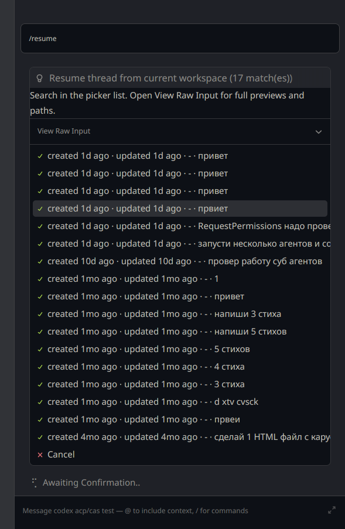
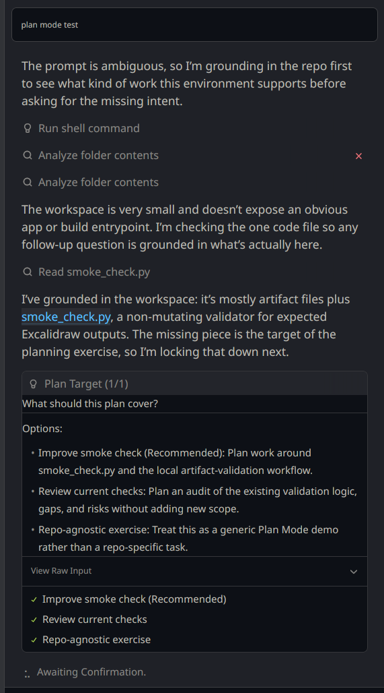
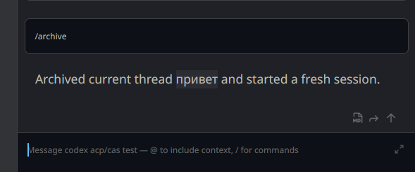
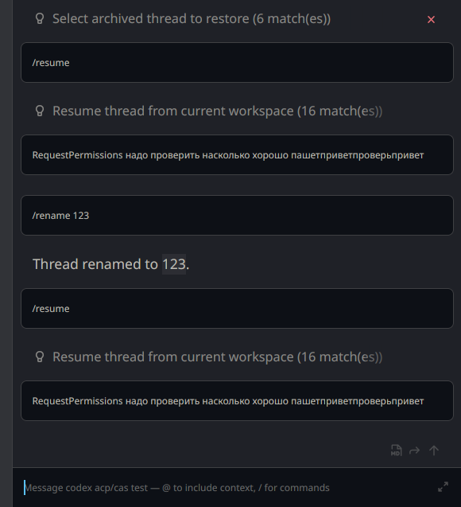
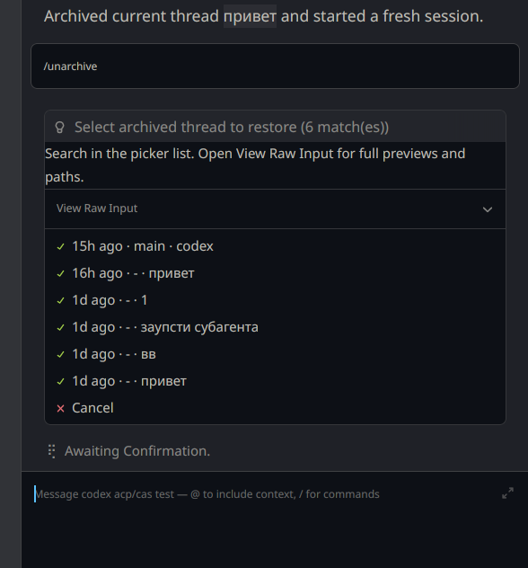
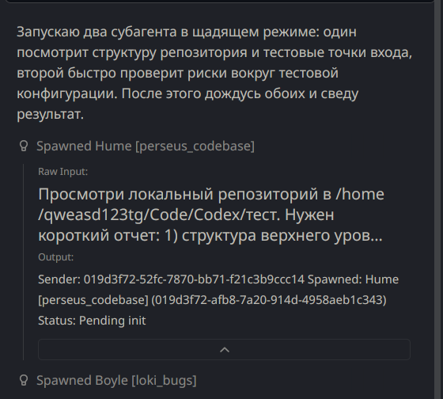

# Codex ACP CAS

`codex-acp` is a practical fork of the Zed Codex ACP adapter. It connects Codex to ACP-compatible clients such as Zed through `codex app-server`.

This fork is focused on real daily use: better startup diagnostics, better session lifecycle behavior, more usable resume/archive/rename flows, and Linux-first stability improvements.

## Status

This project is usable, but still beta.

- Main real-world target today: Linux on `x86_64-unknown-linux-gnu`
- Fedora is the most tested environment today
- GitHub Releases are intended to ship:
  - Linux `x86_64-unknown-linux-gnu`
  - macOS Apple Silicon `aarch64-apple-darwin`
  - Windows `x86_64-pc-windows-msvc`
- Behavior may still change between releases

## Screenshots

### Resume and thread management

Resume picker with workspace-scoped thread selection:



Session selectors and controls:


Limit status and usage view:


### Plan mode

Plan mode and visible planning steps:



### Thread operations

Archive flow:



Rename flow:



Unarchive flow:



### Collaboration UI

Sub-agent and collaboration tool-call rendering:



## Supported Now

- ACP prompt capabilities: embedded context and image input
- Session lifecycle:
  - `new_session`
  - `load_session`
  - `fork_session`
  - `resume_session`
  - `list_sessions`
- Session-scoped MCP passthrough for `stdio` and `http`
- History replay after `load_session` and `resume_session`
- ACP `agent_info.version` is published from the package version, so recent Zed External Agent settings can show the running adapter version
- ACP `auth.logout` is advertised and handled, so recent Zed builds can use their native external-agent logout UI
- Session commands:
  - `/init`
  - `/status`
  - `/review`
  - `/threads`
  - `/resume`
  - `/fork`
  - `/archive`
  - `/unarchive`
  - `/rename`
  - `/compact`
  - `/undo`
  - `/plan`
  - `/diff`
- Better thread title handling for resume/archive/rename/fork flows
- Inline review flows for uncommitted changes, base branches, and specific commits, centered on one ACP picker behind `/review`
- Standard ACP `session/fork` plus practical in-place `/fork` support on top of native `thread/fork`
- Tool call cards for command, MCP, web, image, generated-image, file, and collab branches
- Command cards now show command, cwd, parsed actions, status, and capped head/tail output instead of forcing you into Raw Input for basic context
- Shell-backed `fetch`, `copy`, `move`, `delete`, `mkdir`, and `touch` commands are classified into closer Zed-style tool kinds/titles instead of always looking like generic terminal commands
- Approval previews for those recognized shell-backed file/fetch commands use the same specific tool kinds, so Zed no longer labels them as generic `Run Command` cards
- Generated images are also surfaced as inline markdown images and saved under `~/.codex-cas/generated-images/`.
  This is a pragmatic adapter-side rendering path for current Zed/ACP behavior, not the ideal final contract; a future protocol/Zed path should surface generated images and saved-file links natively.
- Clearer status surfacing through `/status`, the `Status` selector, and native Zed context donut, including adapter/backend version and richer account-limit details when available
- Compact `Status` selector summaries for account limits, session status, MCP, skills, plugins, and compaction
- More reliable context compaction in Zed: `/compact` and the `Status` selector action now keep draining background app-server notifications until completion/failure, so the selector should not stay stuck on `Compacting...`
- Compact chat warnings when account limits cross 75%, 90%, 95%, and exhausted thresholds
- Command approval popups now follow Codex app-server `available_decisions`, including session/matching-command approvals when the backend offers them
- Plain shell command approvals use the same Zed terminal-card path as running command tool calls when the client advertises terminal output support; network/additional-permission approvals stay in the detailed text card
- Grouped `Model` selector entries for model choice, reasoning effort, and Codex app-server `service_tier` speed
- Practical plan mode support
- Better default-mode fallback plan progress for long step lists: visible checkpoints now advance across the list instead of only snapping at the very end of work
- Better startup and reconnect diagnostics, including a slow-start ready notice with version/thread/model context after long session startup paths
- Shorter first-open loading pulse: skills/account/limits metadata now hydrate right after the initial session response instead of blocking `new_session` / `load_session` / `resume_session`
- Safer turn-start timeout and stale turn-tail cleanup around reconnects
- Safer history replay fencing for `/undo` and auto-restored session history
- Less UI freeze risk during `/resume --history` by replaying restored history outside the main session mutex
- Less duplicate file-change I/O when one patch item touches the same path multiple times
- More reliable file navigation from completed grouped file-change diff cards
- Less mutex hold time while waiting for file-change approval prompts
- Less chat stall while command approval prompts are pending
- Faster file-change start cards with ACP snapshot priming moved out of the main session mutex
- Less mutex hold time while final file-change diff is published; ACP buffer writeback still runs outside the main session mutex and can be disabled via `CODEX_ACP_DISABLE_SYNC_EDIT_BUFFERS=1`
- Safer transport drain: stale server requests are rejected during post-turn and pre-prompt cleanup instead of triggering late approvals
- Less reconnect spam: reconnect warnings now collapse into one normalized status line while reconnect-assisted stalled turns still abort cleanly
- Less brittle transport cleanup: background drain and thread-switch flush now wait for the queue to go quiet instead of assuming `64` messages or one tiny timeout is enough
- Less turn-completion lock contention: turn diff rendering now runs outside the main session mutex and optional ACP buffer writeback skips paths already reserved by file-change lifecycle
- Safer Zed buffer writeback after backend edits: the adapter refreshes the current ACP buffer snapshot and skips no-op writes before asking Zed to update an open document, reducing duplicate insertions and format-on-save loops
- Less sparse completed tool cards: no-output commands, MCP results, and completed collab/sub-agent calls now keep a short visible summary while retaining raw details
- Less transport serialization during quiet backend periods: app-server stdout now has a dedicated reader/inbox, so cancel, interrupt, post-turn drain, and thread-switch cleanup do not sit behind one long `next_message()` mutex wait
- `/diff` slash-command: replays the diff of the last turn as an ACP diff card, with `/diff --session`, `/diff --last N`, and optional path filters for wider or narrower review. Diff history is kept in-memory per thread and is cleared on thread switch
- Safer `turn/interrupt` error surfacing: if the backend rejects a cancel request (for example because the turn already finished), the adapter now surfaces that as "not interrupted" in its internal state instead of leaving the UI stuck in Cancelling while the turn continues
- Bounded turn-completion dedup state: completed turn ids are no longer accumulated in an unbounded `HashSet` per session; only the last accepted turn id is kept, which is enough to deduplicate terminal notifications without leaking memory across long-running sessions
- Poisoning-safe client-capabilities access: `ClientCapabilities` is now behind `RwLock` instead of `Mutex`, and both reader and writer tolerate lock poisoning. A panic in one session no longer poisons capabilities for every other session
- Quieter but honest transport drain: during post-turn and background drain the adapter still ignores stop-bearing notifications (that is the drain contract), but it now logs them as `warn!` with turn-id and drain context instead of silently dropping them via `let _ = ...`

## Why Use This Fork

Compared with upstream-oriented adapter work, this fork currently focuses more on:

- Better startup diagnostics when Zed or `codex app-server` fails early
- Better session resume and thread switching behavior
- Better archive, unarchive, and rename handling
- More usable ACP rendering for collaboration and sub-agent flows
- Linux-first practical fixes

## Differences From Upstream

This project does not claim full upstream parity.

Current strengths of this fork:

- More robust startup behavior and clearer logging
- Less startup latency before Zed gets a ready ACP thread
- Better session lifecycle handling in ACP clients
- Less UI freeze risk during `/undo` history rebuilds
- Less UI freeze risk during `/resume --history` thread switches
- Less repeated ACP snapshot and writeback churn on multi-hunk file edits
- Less chat stall while waiting for file edit approval
- Less chat stall while waiting for shell command approval
- Less lock contention while file-change start cards are published
- Less lock contention while file-change completion diff/writeback is published
- Less lock contention while final turn-diff cards and ACP buffer sync are published
- Less risk of ghost approvals from stale app-server requests during drain/flush cleanup
- Less risk of Zed getting stuck behind an unfinished context compaction state after using `/compact` or the compact context selector
- Clearer reconnect UX with one normalized retry status and cleaner reconnect-assisted stall aborts
- More reliable pre-prompt and thread-switch cleanup under bursty app-server tails
- Better transport responsiveness while the backend is quiet: app-server message reads no longer monopolize the transport mutex for the full wait window
- Better thread titles in lists and resumed sessions
- Inline review flows backed by native `review/start`
- Practical thread switching with native `Zed` `New Thread`, `/fork`, `/resume`, and archive-triggered replacement
- Standard ACP `session/fork` surfaced separately from the in-place slash `/fork` flow
- Canonical session status surfacing through `/status` plus the compact context `%` selector
- `plugins` now sit alongside `status`, `MCP`, `skills`, and limits in the context selector UX
- `Speed` is surfaced inside the grouped `Model` selector over Codex `service_tier` and carried through start, resume, fork, and future turns
- More complete collab and sub-agent UI mapping

Current gaps:

- No full structured elicitation parity yet
- Manual `Plan mode` is usable, but it is not an exact match for Codex CLI `update_plan` autoplan rendering; think of it as a CLI-like collaboration flow rather than the same UI contract
- Default-mode fallback checkpoint rendering is intentionally pragmatic ACP UI, not a pixel-for-pixel clone of Codex CLI autoplan visuals
- `DynamicToolCall` is intentionally unsupported in runtime code for now; the old partial implementation was removed and summarized in `docs/drafts/dynamic-tool-call-backup.md`
- Some upstream-style flows are still missing or incomplete, including slash-command `/logout`; native ACP `logout` is supported
- There is still no true delete path end-to-end: `codex app-server` does not give this fork a practical hard-delete flow, and the current ACP bridge in `Zed` still does not surface `session/delete`; use `/archive` when you only need to hide a thread from normal lists
- Slash `/new` is intentionally not surfaced anymore. Use native `Zed` `New Thread` for a real new ACP session; in-place backend switching remains only for `/fork` and archive-triggered replacement flows. Standard ACP `session/fork` is supported by the adapter, but current `Zed` still has no dedicated UI entrypoint for it, so slash `/fork` remains the practical path unless you patch the client. The old soft-new behavior is summarized in `docs/drafts/soft-new-backup.md`
- Some behavior still depends on Zed-side ACP support

## Limitations

- MCP passthrough supports `stdio` and `http` today
- MCP `sse` passthrough is not supported yet
- `item/tool/call` / `DynamicToolCall` requests are rejected as unsupported
- `Speed` is available inside the adapter `Model` selector. It primarily exposes `service_tier=fast`, with `flex` available as the alternate Codex service tier. Zed's native toolbar fast-mode button is currently native-thread/staff/model-gated and is not a generic custom ACP control, so custom ACP users should use the adapter selector instead.
- The grouped `Model` selector is an adapter-side workaround for current ACP/Zed limits. ACP `select` exposes only one `current_value`, and current Zed does not provide native multi-current state, toolbar overflow control, or nested selector state for external ACP agents. The adapter therefore marks active nested entries such as reasoning and speed with short labels like `★ High` / `★ Fast` and keeps details in option descriptions.
- `/undo` itself works, and the adapter also exposes rollback via ACP ext methods, but the visual rewind/edit button and the pencil-style edit UX in current `Zed` still depend on a client-side ACP fix: the external-agent ACP bridge does not wire `truncate()` / rollback ext-methods for this flow yet. In practice that means patching or rebuilding `Zed` if you want the native button UX
- Zed Agent Panel message queueing is asymmetric today: native `Zed Agent` can send queued messages at turn/tool-call boundaries, but external ACP agents receive queued messages only after the current generation finishes. Zed `1.3.0` fixed the stray finished notification before a queued message is sent, but not the external-agent boundary itself. The pinned Codex app-server has `turn/steer`, so the backend can accept mid-turn steering, but this adapter cannot expose a real CLI-style "send before the next tool call" UX until `Zed` forwards queued external-agent prompts before generation completion.
- Recent Zed releases center external agents around the Threads Sidebar, Parallel Agents, ACP Registry installs, and External Agent settings. This adapter should fit that native shell instead of duplicating thread/worktree orchestration inside slash commands.
- Zed `1.3.0` / `zed-industries/zed#56446` added client-side editing for external-agent thread titles. In current Zed this is stored as Zed sidebar `title_override` metadata for ACP external agents; it does not call back into the adapter to persist the Codex backend thread name. Use `/rename` when the rename must persist in Codex thread history or be visible to other clients.
- The selected-agent / `New Thread` trigger in current `Zed` can show a visibly odd pulsing state that appears only while the pointer is moving. In practice this looks like a client-side repaint/animation quirk, not an ACP startup stall in the adapter
- While history replay is restoring after `load_session` or replaying `/undo`, new prompts and session commands are intentionally fenced until replay finishes; this avoids overlapping turn/replay state in one ACP session
- Linux is the most tested platform right now
- Multi-platform release artifacts can exist before all platforms are equally tested in real use

## Install

### From GitHub Releases

Current release artifacts are plain binaries, `.sha256` files, and the Bash installer:

- `codex-acp-linux-x86_64-gnu`
- `codex-acp-macos-aarch64-apple-darwin`
- `codex-acp-windows-x86_64-pc-windows-msvc.exe`
- matching `.sha256` files
- `install.sh`
- `install.sh.sha256`

On Linux/macOS, the installer can detect the current OS/CPU, download the matching
GitHub Release artifact, verify its `.sha256`, install it to a stable path, and
create the adapter config directory:

Latest release:

```bash
curl -fsSLO https://github.com/Qweasd123tg/zed-codex-ACP-CAS/releases/latest/download/install.sh
bash install.sh
```

Pinned release:

```bash
bash install.sh --download 0.23.5
```

Manual artifact install still works if you already downloaded the binary:

```bash
bash install.sh --from-binary ./codex-acp-linux-x86_64-gnu --sha256 ./codex-acp-linux-x86_64-gnu.sha256
```

Then configure Zed to use the binary path:

```json
{
  "agent_servers": {
    "codex-acp-cas": {
      "type": "custom",
      "command": "/home/your-user/.local/bin/codex-acp"
    }
  }
}
```

Windows example:

1. Put `codex-acp-windows-x86_64-pc-windows-msvc.exe` somewhere stable and rename it to `codex-acp.exe` if desired.
2. Verify the matching `.sha256` file before installing.
3. Make sure the `codex.exe` that provides `codex app-server` is available to the adapter. You can do that with `PATH`, or set `CODEX_ACP_CODEX_BIN` to the absolute `codex.exe` path.
4. If you rely on the ChatGPT extension's bundled `codex.exe`, use a small wrapper next to `codex-acp.exe`:

```cmd
@echo off
set "CODEX_ACP_CODEX_BIN=C:\Users\LOQ\.vscode\extensions\openai.chatgpt-26.422.71525-win32-x64\bin\windows-x86_64\codex.exe"
"%~dp0codex-acp.exe" %*
```

Configure Zed to launch that wrapper through `cmd.exe`:

```json
{
  "agent_servers": {
    "codex-acp-cas": {
      "type": "custom",
      "command": "C:\\Windows\\System32\\cmd.exe",
      "args": [
        "/d",
        "/s",
        "/c",
        "\"\"C:\\Users\\LOQ\\Desktop\\test\\codex-acp-zed.cmd\"\""
      ]
    }
  }
}
```

The double quoting in the final argument is intentional for `cmd.exe /s /c`; it keeps paths with spaces from being split before the adapter starts.

### Upgrade Notes For 0.25.2

Command tool cards now drive the Zed-visible title/status/terminal surfaces
directly. Shell commands use ACP `Terminal` content plus Zed's display-only
terminal metadata when the client advertises terminal output support, while
read/list/search commands keep concise text output such as empty-directory
summaries. This is the path Zed uses for copied transcripts like
`**Tool Call: ...**`, `Status: Completed`, and `Terminal:`.

### Upgrade Notes For 0.25.1

Command tool cards now use a Zed-style transcript body. The visible content
starts with `**Tool Call: ...**`, uses title-case status labels, shows short
list-directory results as plain text, and puts normal terminal output under a
`Terminal:` fenced block. Raw Input still carries the exact command and parsed
actions, while Raw Output keeps the exit/status payload when the backend provides
one.

### Upgrade Notes For 0.25.0

Command tool cards are no longer bare placeholders. Started/completed/replayed
command cards include the command, cwd, parsed actions, status, and a bounded
head/tail output preview while keeping Raw Input/Raw Output for exact protocol
payloads.

`/status` and the `Context` selector's session status now include the running
adapter version and the backend Codex CLI version captured from the app-server
thread. Account-limit details also surface the limit id/name and credits when
the current pinned app-server protocol provides them.

If session startup takes more than a short threshold, the adapter emits a compact
system status message after the ACP session is ready. The earlier Zed registry
download/install indicator is still Zed-side UI; CAS can only report status
after Zed has connected the ACP session.

### Upgrade Notes For 0.23.5

Local installs now have one canonical entrypoint: `./install.sh`. It builds from
source when run inside a checkout, or downloads the latest GitHub Release when run
as a standalone release asset. It installs atomically to `~/.local/bin/codex-acp`,
writes `codex-acp.build-info.txt`, smoke-tests the installed binary before
activation, and creates the adapter config home. Use `--download <version>` for a
pinned release and `--from-binary` for already downloaded artifacts.

Adapter-owned state is now treated as a current local contract, not as a migration
surface from older layouts. By default it lives in:

```text
~/.codex-cas/
```

The adapter creates editable default `selector-preferences.json` and
`display-maps.json` there when they are missing. It no longer scans or copies
older `$CODEX_HOME/codex-acp/` or `$CODEX_HOME/memories/codex-acp/` files during
startup.

The installer creates the config directory only. The adapter itself writes
`selector-preferences.json` and `display-maps.json` on first session startup so
the generated config schema has a single source of truth in the Rust code.

Existing user configs are intentionally not treated as disposable defaults. If a
JSONC file is invalid, session startup fails with the exact file path so you can
fix or remove that file. The adapter will not silently overwrite manual config.

Set `CODEX_CAS_HOME=/some/path` before launching Zed if you need the adapter
state somewhere other than `~/.codex-cas/`.

### Add To Zed

1. Install `codex-acp` with `./install.sh` or from a release artifact and make sure the binary path is stable.
2. Open your Zed settings JSON.
3. Add a custom agent server entry pointing to the `codex-acp` binary.
4. Restart Zed if the new agent does not appear immediately.

For normal local use, point Zed at `~/.local/bin/codex-acp`. If you run the adapter
directly from a repository checkout during local development, prefer
pointing Zed at `.build/codex-acp-current` and rebuilding with:

```bash
bash script/build_local_release.sh
```

That script overwrites `.build/codex-acp-current` and writes matching build info. Rebuilding only
`target/release/codex-acp` does not update the binary path if Zed is configured to use
`.build/codex-acp-current`.

Nested selector preferences are persisted by the adapter because ACP/Zed only exposes one
`currentValue` per selector. The file lives under:

```text
~/.codex-cas/selector-preferences.json
```

Set `CODEX_CAS_HOME` to override this adapter-owned directory. On first startup after the path
split, the adapter creates current config files there if they do not already exist.

The adapter creates this file on session startup if it is missing. Existing files are never treated
as disposable defaults: invalid JSON/JSONC now fails session startup with the file path instead of
being silently replaced. The file is JSON with comments (`//` and `/* ... */` are accepted; trailing
commas are accepted). This preserves choices such as lower selector layout/status variants,
default model/reasoning/speed, per-model and per-effort
labels/descriptions, and compact model/effort filters across restarts. It also keeps visual style
controls out of the lower selector menus and allows a conservative layout override over known
selectors.
When a selector choice is persisted, the adapter rereads the current file first and preserves manual
per-model `name` / `description` overrides instead of regenerating model labels from memory.

Default config:

```jsonc
{
  // Defaults applied when a new ACP session starts. null keeps the app-server default.
  "defaults": {
    "model": null,
    "reasoning_effort": null,
    "service_tier": null
  },

  // Model selector controls. Comment out list rows to hide them; row order controls menu order.
  "model_selector": {
    "models": [
      {
        "id": "gpt-5.5",
        "name": "Main",
        "description": "Main daily coding model"
      },
      "gpt-5.4",
      "gpt-5.4-mini",
      // "gpt-5.3-codex",
      // "gpt-5.2"
    ],
    "reasoning_efforts": [
      // "none",
      // "minimal",
      "low",
      "medium",
      {
        "id": "high",
        "name": "High",
        "description": "Greater reasoning depth for complex problems"
      },
      "xhigh"
    ]
  },

  // Lower selector order, titles, visibility, and group order.
  "layout": {
    "order": ["permissions", "model", "status"],
    "permissions": {
      "visible": true,
      "name": "Permissions",
      "groups": ["workflow", "guarded", "bypass"]
    },
    "model": {
      "visible": true,
      "name": "Model",
      "groups": ["models", "effort", "speed"]
    },
    "status": {
      "visible": true,
      "name": "Status",
      "groups": ["status"]
    }
  },

  // Slash commands. Comment out list rows to hide/block them; row order controls Zed command order.
  "slash_commands": [
    "init",
    "status",
    "review",
    "threads",
    "resume",
    "fork",
    "archive",
    "unarchive",
    "compact",
    "undo",
    "plan",
    "rename",
    "diff",
  ]
}
```

Account-limit labels use a separate JSONC file because they are pure `percent -> label`
maps rather than selector state:

```text
~/.codex-cas/display-maps.json
```

The adapter creates a minimal default that renders app-server remaining quota as percent labels.
`limits.summary` stores the currently selected summary windows. `limits.summary_options` controls
which variants appear in the lower `Status` selector, their ids, optional names/descriptions, and
the windows rendered by each variant. Use `["primary"]` for only the 5-hour window or
`["primary", "secondary"]` for the combined 5-hour + weekly label.

```jsonc
{
  // Account limit display maps. Values receive percentages in the 0..100 range.
  // limits.summary stores the selected summary option windows.
  // limits.summary_options controls visible Status selector variants.
  "limits": {
    "summary": ["primary", "secondary"],
    "summary_options": [
      { "id": "primary", "summary": ["primary"] },
      { "id": "primary_secondary", "summary": ["primary", "secondary"] }
    ],
    "primary": "five_hour_percent",
    "secondary": "weekly_percent"
  },
  "maps": {
    "five_hour_percent": {
      "kind": "template",
      "template": "5h {value}%",
      "unavailable": "5h --"
    },
    "weekly_percent": {
      "kind": "template",
      "template": "wk {value}%",
      "unavailable": "wk --"
    }
  }
}
```

Maps can be `template`, `exact`, or `thresholds`. `exact` maps individual integer percentages;
`thresholds` uses the highest row where `min <= value`. `exact` maps must either cover every value
from `0` through `100` or define an explicit `fallback`; `thresholds` maps must either include a
`min: 0` row or define an explicit `fallback`. Limit percentages are remaining quota. The `5h` /
`wk` prefixes are not special runtime labels; they are just part of the default templates above.
Selected map ids in `limits.primary` and `limits.secondary` must exist in `maps`; a partial or stale
file fails startup instead of silently falling back to a hardcoded display.

Ready-to-use display-map examples are kept in:

- `examples/display-maps/text.jsonc`
- `examples/display-maps/bars.jsonc`
- `examples/display-maps/block.jsonc`

Copy one of them to `~/.codex-cas/display-maps.json` if you want that style. These files
are tested fixtures, so their JSONC shape stays aligned with the runtime loader.

Example: keep `gpt-5.5` as the practical default, hide older/noisy model entries, and keep only
medium/high effort choices in the selector:

```jsonc
{
  "defaults": {
    "model": "gpt-5.5",
    "reasoning_effort": "high",
    "service_tier": null
  },
  "model_selector": {
    "models": [
      {
        "id": "gpt-5.5",
        "name": "5.5",
        "description": "Main daily coding model"
      },
      "gpt-5.4",
      "gpt-5.4-mini"
      // "gpt-5.3-codex",
      // "gpt-5.2"
    ],
    "reasoning_efforts": [
      // "none",
      // "minimal",
      // "low",
      "medium",
      {
        "id": "high",
        "name": "много",
        "description": "Глубже думает, но сильнее тратит лимиты"
      }
      // "xhigh"
    ]
  }
}
```

The example is intentionally partial: any missing fields keep their current/default values.

Fields:

- `defaults.model`: startup default model id, or `null` to keep the app-server/session default.
- `defaults.reasoning_effort`: startup default for reasoning effort.
  Common values: `minimal`, `low`, `medium`, `high`, `xhigh`, or `null` to use the backend/model default.
  `minimal` is real Codex/API config, but current app-server turns can fail with
  `image_gen`/`web_search` enabled because those tools are not compatible with
  `reasoning.effort = "minimal"`. `none` is protocol-visible mainly for plan/collaboration
  overrides; in this adapter it can work for simple turns, but normal model turns may still reject it.
- `defaults.service_tier`: startup default service tier. `null` clears any saved override and uses
  the app-server default.
  Values: `fast`, `flex`, or `null` for the standard/default tier.
- `model_selector.models`: ordered visible model list for the lower `Model` selector.
  Rows can be model id strings or objects with `id`, `name`, and `description`.
  Comment out a row to hide it. The list order controls menu order.
  `name` overrides the visible model label, `description` overrides the hover text, and the
  currently selected model remains visible even if omitted, so Zed never gets a `currentValue`
  without a matching option.
  There is no separate model-label style toggle anymore.
- `model_selector.reasoning_efforts`: ordered visible effort list for the lower `Model -> Effort`
  group. Rows can be effort id strings or objects with `id`, `name`, and `description`.
  Comment out a row to hide it. The list order controls menu order.
  `name` overrides the visible effort label, `description` overrides the hover text.
  `none` and `minimal` are present as experimental/protocol entries;
  if enabled manually, the selector will show them even when the current backend model list does
  not advertise them. The backend may still reject unsupported combinations; observed failure:
  `minimal` with `image_gen`/`web_search` returns an invalid-request error.
- `layout.order`: order of lower selectors.
  Known ids: `permissions`, `model`, `status`.
- `layout.<selector>.visible`: show or hide a selector.
  Values: `true`, `false`.
- `layout.<selector>.name`: selector title shown by Zed.
- `layout.<selector>.groups`: whitelist and order of known groups inside that selector.
- `slash_commands`: ordered surfaced slash-command list.
  Comment out a row to hide the command from Zed and reject it when typed manually.
  Row order controls Zed command order.

Known groups:

- `permissions`: `workflow`, `guarded`, `bypass`.
- `model`: `models`, `effort`, `speed`.
- `status`: `status`, `integrations`, `actions`.

Known slash commands:

- `init`, `status`, `review`, `threads`, `resume`, `fork`, `archive`, `unarchive`, `compact`, `undo`, `plan`, `rename`, `diff`.

Unknown selector/group ids are ignored; if a group override matches nothing, the adapter keeps the
default groups to avoid rendering an empty selector.

Example:

```json
{
  "agent_servers": {
    "codex-acp-cas": {
      "type": "custom",
      "command": "/home/your-user/.local/bin/codex-acp"
    }
  }
}
```

If `codex` is not already available in your environment, make sure it is installed and visible in `PATH`, or set `CODEX_ACP_CODEX_BIN` to its absolute path, because this adapter starts `codex app-server` under the hood.

### Build From Source

Requirements:

- Rust toolchain
- `codex` available in your environment

The local helper scripts in `script/` are bash-oriented and currently target Linux/macOS-style local development. On Windows, build with Cargo directly:

```powershell
cargo build --release --target x86_64-pc-windows-msvc
```

Install from source:

```bash
./install.sh
```

Install the latest release without cloning:

```bash
curl -fsSLO https://github.com/Qweasd123tg/zed-codex-ACP-CAS/releases/latest/download/install.sh
bash install.sh
```

Install from source with the full local check set first:

```bash
./install.sh --with-checks --checks-mode full
```

The installed binary path is `~/.local/bin/codex-acp` by default. The development-only
local release script still writes a runnable cache binary to `.build/codex-acp-current`:

```bash
bash script/build_local_release.sh
```

## Development Checks

Basic local checks:

```bash
cargo test
cargo fmt --all -- --check
cargo clippy --all-targets --all-features -- -D warnings
```

Release-target check for Linux:

```bash
cargo test --release --target x86_64-unknown-linux-gnu
```

## Release Preparation

Local release sanity for the Fedora/Linux target should finish with:

```bash
cargo fmt --all -- --check
cargo test
cargo clippy --all-targets --all-features -- -D warnings
bash script/build_local_release.sh
./install.sh
```

For a tagged GitHub release, work from `main` and use the release helper after
the user-facing docs and version are ready:

```bash
script/prepare_release.sh 0.23.5
git push origin main
git push origin v0.23.5
```

The `v*` tag triggers `.github/workflows/release.yml`, which validates the tag
against `Cargo.toml` and builds the Linux, macOS Apple Silicon, and Windows
artifacts listed above. The workflow also publishes `install.sh` and
`install.sh.sha256`. The helper script writes a local bundle under
`.releases/v<version>/`; those local filenames include the version and host
platform, while GitHub Release artifact names intentionally use the stable names
shown in the install section.

## Configuration

Useful environment variables:

- `RUST_LOG=codex_acp=debug`
- `RUST_BACKTRACE=1`
- `CODEX_CAS_HOME=<adapter-owned config/cache directory>`
- `CODEX_ACP_CODEX_BIN=<absolute path to codex or codex.exe>`
- `CODEX_ACP_STARTUP_TIMEOUT_MS=<milliseconds>`
- `CODEX_ACP_STARTUP_METADATA_TIMEOUT_MS=<milliseconds>`
- `ACP_DISABLE_AUTO_RESTORE=1` for emergency startup debugging only

`CODEX_ACP_STARTUP_TIMEOUT_MS` now also bounds the `turn/start` handshake, so an app-server that stops responding before it returns a `turn_id` does not leave the ACP UI spinning forever.
Timeout override values must be positive integer milliseconds. Invalid values now fail the request instead of silently using the built-in timeout.

Do not keep `ACP_DISABLE_AUTO_RESTORE=1` in your normal Zed configuration. It suppresses the earliest startup-driven backend restore right after the agent boots, which can make history entries appear in Zed while their chat content does not load. Use it only as a temporary diagnostic option if startup restore itself is hanging.

If Zed asks the adapter to load an old local history row whose id is not a materialized Codex rollout, the adapter now falls back to a fresh backend thread under the same Zed session handle instead of failing startup with `Invalid params`. Normal Codex-backed sessions still restore and replay from the backend history first.

## Troubleshooting

If Zed seems to hang or the adapter looks like it crashed, run Zed from a terminal:

```bash
RUST_LOG=codex_acp=debug RUST_BACKTRACE=1 zed
```

Important log lines:

- `Starting codex app-server process`
- `Initializing codex app-server`
- `Sending startup-sensitive app-server request`
- `Queued app-server request while waiting for a response`
- `Timed out waiting for app-server startup response`
- `codex app-server closed stdout`
- `Turn appears stuck after repeated reconnect failures`

What they usually mean:

- Timeout during `initialize`, `thread/start`, or `turn/start`: app-server is stuck before the adapter can safely continue, or the bundled `codex.exe` version is incompatible with this adapter's pinned app-server protocol
- `failed to start 'codex' app-server`: `codex` is missing or not available in `PATH`; on Windows, set `CODEX_ACP_CODEX_BIN` to the intended `codex.exe`
- `Turn appears stuck after repeated reconnect failures`: the adapter aborted a stalled turn and drained queued tail notifications so the next prompt starts from a clean state
- Panic backtrace: the adapter or child process crashed directly

On Windows, test the same wrapper that Zed launches:

```cmd
where codex
codex --version
codex app-server --help
C:\Windows\System32\cmd.exe /d /s /c ""C:\Users\LOQ\Desktop\test\codex-acp-zed.cmd" --help"
```

Recent hardening in this fork:

- `ItemStarted` and `ItemCompleted` from the wrong `turn_id` are ignored instead of creating stale tool cards after reconnect or thread switch
- reconnect-stall watchdog abort now runs the same post-turn drain path as normal turn completion

## More Docs

User-facing documentation stays in this README. Deeper project notes are kept separately:

- [docs/upstream-feature-matrix.md](docs/upstream-feature-matrix.md)
- [docs/thread-feature-map.md](docs/thread-feature-map.md)
- [AGENTS.md](AGENTS.md)

Current Zed-specific UI caveats are tracked in [docs/upstream-feature-matrix.md](docs/upstream-feature-matrix.md), especially around approval-card layout and command/review/session UX that the adapter alone cannot fully control.

The latest local upstream reference sweep was run on `2026-06-13`. At that point Zed stable was `1.6.3`, preview was `1.7.2`, official `codex-acp` was `v0.16.0`, and ACP had moved through `v0.13.6` with stabilized `additionalDirectories`, session usage updates, and `session/delete`. Treat dependency updates as scoped migrations, not a mechanical version bump.

If Zed's agent input area or lower selector toolbar looks squeezed, enable Zed's content-width
limit:

```jsonc
// zed://settings/agent.limit_content_width
{
  "agent": {
    "limit_content_width": true
  }
}
```

That is a Zed panel layout setting, not an ACP adapter option.

## Roadmap

Near-term work:

- Keep refining the compact context `%` selector and `/status` report where it helps daily use
- Audit and selectively port upstream `codex-acp v0.16.0` parity items: `additionalDirectories`, session usage/delete semantics, richer permission/account-limit mapping, plan update rendering, and the next permission/elicitation details
- Keep new slash/preview UX scoped to explicit user demand; avoid adding parallel flows when Zed already has native UI

Later candidates:

- `/debug-config`

Not a priority for this fork right now:

- `close_session` as a user-visible focus area in current Zed
- slash-command `/logout`
- `fs/watch`
- app-server feature flags plumbing
- `codex_home` surfacing
- remote auth through client

## License

Apache-2.0. See [LICENSE](LICENSE).
