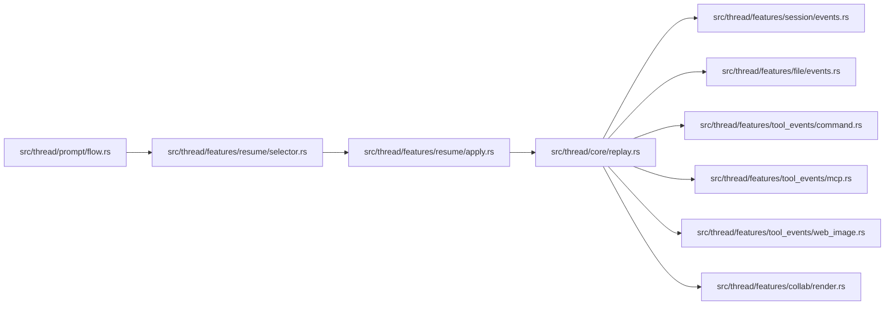
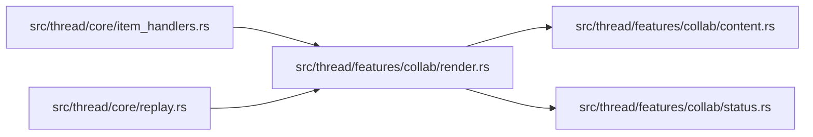

# Thread Feature Map

Единая карта связности `src/thread/**`.

Цель: быстро понять, какие файлы нужно менять вместе, чтобы локальная правка в одной ветке не ломала соседние части пайплайна.

Обновлено: `2026-04-24` (`session/fork` surfaced in `CodexAgent`, app-server transport split into reader/request-policy modules, `fast_mode` is surfaced as `Speed`, and failed resume-by-id can recover through `thread/read` path discovery).

Важно: `collab/subagents` не отдельная архитектура.
Это обычная ветка `ThreadItem::CollabAgentToolCall` внутри общего event-pipeline.

## 1) Принципы текущей структуры

1. `src/thread.rs` хранит оркестрацию, состояния и общие константы.
2. `src/thread/core/*` — роутеры и glue (`item_handlers`, `replay`, `server_requests`, `inner_state`, `terminal_updates`).
3. `src/thread/features/*` — доменные срезы (`plan`, `file`, `tool_events`, `tool_call_ui`, `collab`, `session`, `resume`, `notification`, `approvals`).
4. `src/thread/{prompt,notification,session,turn}/*` — вертикальные runtime-потоки.
5. Текущий стиль зависимости: прямые импорты из конкретных подмодулей вместо зонтичных прокладок.

## 2) Главный runtime pipeline (live turn)

```mermaid
flowchart TD
    UserClient[User/Zed] --> PromptFlow[src/thread/prompt/flow.rs]

    PromptFlow --> PromptCommands[src/thread/prompt/commands.rs]
    PromptFlow --> ResumeListing[src/thread/features/resume/listing.rs]
    PromptFlow --> ResumeSelector[src/thread/features/resume/selector.rs]
    PromptFlow --> SessionControls[src/thread/features/session/controls.rs]
    PromptFlow --> SessionModes[src/thread/features/session/modes.rs]
    PromptFlow --> TurnExecution[src/thread/turn/execution.rs]

    TurnExecution --> AppServer[src/app_server.rs]
    AppServer --> NotificationDispatch[src/thread/notification/dispatch.rs]

    NotificationDispatch -->|JSONRPCNotification| NotificationFeature[src/thread/features/notification/mod.rs]
    NotificationDispatch -->|JSONRPCRequest| ServerRequests[src/thread/core/server_requests.rs]

    ServerRequests --> ApprovalsCommand[src/thread/features/approvals/command.rs]
    ServerRequests --> ApprovalsFile[src/thread/features/approvals/file_change.rs]
    ServerRequests --> ApprovalsUserInput[src/thread/features/approvals/user_input.rs]
    ServerRequests --> ApprovalsPermissions[src/thread/features/approvals/permissions.rs]

    NotificationFeature --> NotificationDeltas[src/thread/features/notification/events/deltas.rs]
    NotificationFeature --> NotificationTurn[src/thread/features/notification/events/turn.rs]
    NotificationFeature --> NotificationUsage[src/thread/features/notification/events/usage.rs]
    NotificationFeature --> NotificationWarnings[src/thread/features/notification/events/warnings.rs]
    NotificationFeature --> ItemHandlers[src/thread/core/item_handlers.rs]
    NotificationFeature --> TerminalUpdates[src/thread/core/terminal_updates.rs]
    NotificationFeature --> TurnDiff[src/thread/turn/diff.rs]

    ItemHandlers --> FileEvents[src/thread/features/file/events.rs]
    ItemHandlers --> ToolEventsCommand[src/thread/features/tool_events/command.rs]
    ItemHandlers --> ToolEventsMcp[src/thread/features/tool_events/mcp.rs]
    ItemHandlers --> ToolEventsWebImage[src/thread/features/tool_events/web_image.rs]
    ItemHandlers --> PlanEvents[src/thread/features/plan/events.rs]
    ItemHandlers --> CollabRender[src/thread/features/collab/render.rs]
    ItemHandlers --> SessionEvents[src/thread/features/session/events.rs]

    ToolEventsCommand --> ToolUiKind[src/thread/features/tool_call_ui/kind.rs]
    ToolEventsCommand --> ToolUiTitle[src/thread/features/tool_call_ui/title.rs]
    ToolEventsCommand --> ToolUiRaw[src/thread/features/tool_call_ui/raw.rs]
    ToolEventsCommand --> StatusMapping[src/thread/features/status_mapping.rs]
    ToolEventsMcp --> StatusMapping
    FileEvents --> StatusMapping
    FileEvents --> FileChanges[src/thread/features/file/changes.rs]

    TurnExecution --> PlanParse[src/thread/features/plan/parse.rs]
    TurnExecution --> PlanFallback[src/thread/features/plan/fallback.rs]
    TurnExecution --> ReconnectGuard[src/thread/turn/execution.rs]
    AppServer --> AppServerReader[src/app_server/reader.rs]
    AppServer --> AppServerPolicy[src/app_server/request_policy.rs]
```



## 3) Почему `notification` есть и в `features`, и отдельно

Это разделение по слоям:
- `src/thread/notification/dispatch.rs` — транспортный слой JSON-RPC (`notification/request/response/error`).
- `src/thread/features/notification/*` — доменная обработка событий.

`dispatch` должен маршрутизировать, а не содержать бизнес-логику.
С апреля 2026 transport-поток здесь уже не равен прямому `stdout.read -> hold app mutex -> handle message`:
`src/app_server.rs` теперь держит процесс и request API, `src/app_server/reader.rs` — background reader, active RPC response matching и inbox для out-of-band сообщений, а `src/app_server/request_policy.rs` — startup timeout/reject policy.
Из-за этого `turn/execution`, post-turn drain и thread-switch flush могут ждать входящие сообщения без длинного удержания transport mutex.

## 4) Replay/Resume pipeline



Смысл: после `/resume` UI по умолчанию восстанавливается теми же доменными ветками, что и в live-потоке.
Для "тихого" переключения контекста без replay используется `/resume --no-history`.
Для устойчивого повторного `/resume` в одной ACP-сессии transport-хвост app-server теперь санируется в `src/thread/features/resume/apply.rs`, а сам picker создается с уникальным `ToolCallId` в `src/thread/features/resume/selector.rs`.
Смысл этой санитизации: stale notifications старого треда глушатся, stale server requests явно отклоняются ответом, а не теряются молча.
Picker и `/threads` при этом предпочитают `thread.name`, если тред был явно переименован через `/rename`, и только потом показывают `preview`.
После успешного `/resume` текущая ACP-сессия теперь сразу получает `SessionInfoUpdate` с `title` и `updated_at`, чтобы клиентский заголовок не застревал на последнем slash-prompt, а history/recent списки не деградировали в `Unknown`.
При этом live `ThreadNameUpdated` во время активного turn теперь не форсит ACP `title` мгновенно: автообновление имени буферизуется и публикуется уже после завершения turn, чтобы не сбивать client-side provisional-title / generating UX в `Zed`.
При восстановлении history из Zed `load_session` / `resume_session` больше не подменяют `no rollout found` пустым fresh backend-thread. `src/thread/session/lifecycle.rs` сначала делает startup retry, затем пробует `thread/read(include_turns=false)` как path-discovery fallback и повторяет `thread/resume` по найденному rollout path. Если история реально отсутствует или тред ещё не materialized до первого user message, клиент получает явную ошибку вместо визуально открытой пустой сессии.
Для `load_session` и `/undo` history replay теперь дополнительно fenced через `history_replay_in_progress`: pending-состояние выставляется заранее в `src/codex_agent.rs` / `src/thread/session/view.rs`, а `src/thread/prompt/flow.rs` не пускает новый prompt или session command, пока `src/thread/core/replay.rs` ещё восстанавливает историю.
Это же позволяет не держать `ThreadInner` mutex во время тяжёлого `/undo` replay: `thread_rollback`, label-cache warmup и snapshot нужных полей остаются под lock, а сам `replay::replay_turns(...)` идёт уже после выхода из критической секции.
Тот же паттерн теперь применён и к `/resume --history`: selector остаётся тонким, а `src/thread/features/resume/apply.rs` под lock делает transport scrub, `thread_resume`, runtime state sync и snapshot replay-данных, после чего history replay идёт уже вне общего mutex под тем же `history_replay_in_progress` fence.
При включённом `ACP_DISABLE_AUTO_RESTORE=1` `src/codex_agent.rs` подавляет только самый ранний startup-driven backend-restore в небольшом окне после старта агента: вместо него поднимается fresh backend-thread под тем же ACP session handle. Более поздние явные открытия из history снова идут через нормальный restore-path.
Для `new_session` / `load_session` / `resume_session` skills summary, account status и rate limits теперь не держат критический startup path до первого ready-thread: `src/thread/session/lifecycle.rs` инициализирует сессию placeholder-значениями, а `src/thread/session/view.rs` сразу после первого session response догружает эти метаданные и шлет `ConfigOptionUpdate`.
Важно: старые сообщения, уже показанные ACP-клиентом, при этом не очищаются — это ограничение UI/API клиента, а не replay-пайплайна адаптера.
Отдельно: `/undo` rollback-flow у адаптера рабочий, и ACP ext rollback methods тоже реализованы в `src/codex_agent.rs`, но native rewind/edit button и pencil-style edit UX по-прежнему упираются в client-side wiring `Zed`: внешний ACP bridge пока не wire-ит `truncate()` / ext rollback path для этого сценария.
Остальные client-side caveat'ы для `session/fork`, history delete и `New Thread` trigger сознательно сведены в `docs/upstream-feature-matrix.md`, чтобы эта карта оставалась картой потока и зависимостей, а не дублирующей сводкой UI-ограничений.

## 5) Collab/Subagents ветка



Ключевая инварианта: симметрия `started -> completed -> replay`.

Текущий протокольный контракт в коде:
- `CollabAgentTool`: `SpawnAgent`, `SendInput`, `ResumeAgent`, `Wait`, `CloseAgent`.
- `CollabAgentToolCallStatus`: `InProgress`, `Completed`, `Failed`.
- `CollabAgentStatus`: `PendingInit`, `Running`, `Completed`, `Errored`, `Shutdown`, `NotFound`.

Если upstream расширяет этот контракт, менять вместе:
- `src/thread/features/collab/render.rs` для title/kind/live/replay поведения;
- `src/thread/features/collab/status.rs` для ACP-status mapping и summary line;
- `src/thread/features/collab/content.rs` для text payload, `raw_input`/`raw_output` и новых полей `agents_states[*]`;
- `src/thread/core/tests.rs` для фиксированных title/status/content ожиданий;
- `README.md` и `AGENTS.md`, чтобы правила и user-facing docs не отставали от кода.

Отдельная инварианта по данным: не терять `sender_thread_id`, `receiver_thread_ids`, `prompt`, `agents_states[*].status`, `agents_states[*].message` при live/update/replay.
Текущий UI-договор поверх этого контракта: thread metadata используется как label-cache для `agent_nickname/agent_role`, prompt у `spawn/send_input` уходит в `Raw Input`, а `Raw Output` хранит краткую summary статусов вместо сырого JSON.

## 6) Что менять вместе (чеклист)

1. Новый `ThreadItem` в потоке:
- `src/thread/core/item_handlers.rs` (live started/completed)
- `src/thread/core/replay.rs` (replay)
- `src/thread/features/status_mapping.rs` (если новый status mapping)

2. Изменение plan-логики:
- `src/thread/turn/execution.rs`
- `src/thread/features/plan/fallback.rs`
- `src/thread/features/plan/parse.rs`
- `src/thread/features/plan/events.rs`
- `src/thread/features/notification/events/turn.rs`
- `src/thread/prompt/flow.rs`

3. Изменение slash/prompt workflow (`/init`, `/review`, `/plan <prompt>` и похожие fixed prompt-turn ветки):
- `src/thread/prompt/commands.rs`
- `src/thread/prompt/flow.rs`
- `src/thread/core/tests.rs`
- `README.md` / `docs/upstream-feature-matrix.md` для surfaced command parity

4. Изменение file-change lifecycle:
- `src/thread/features/file/events.rs`
- `src/thread/features/file/changes.rs`
- `src/thread/features/approvals/file_change.rs`
- `src/thread/turn/diff.rs`

5. Изменение approval-flow:
- `src/thread/core/server_requests.rs`
- `src/thread/features/approvals/command.rs`
- `src/thread/features/approvals/file_change.rs`
- `src/thread/features/approvals/user_input.rs`
- `src/thread/features/approvals/permissions.rs`
- `src/thread/turn/execution.rs`

6. Изменение session/config, archive и thread title:
- `src/thread/session/config/mod.rs`
- `src/thread/session/config/context.rs`
- `src/thread/session/config/context/mcp.rs`
- `src/thread/session/config/context/skills.rs`
- `src/thread/session/config/context/plugins.rs`
- `src/thread/session/config/fast_mode.rs`
- `src/thread/session/config/limits.rs`
- `src/thread/session/config/modes.rs`
- `src/thread/session/config/reasoning.rs`
- `src/thread/session/settings.rs`
- `src/thread/features/session/modes.rs`
- `src/thread/features/session/controls.rs`
- `src/thread/features/session/events.rs`
- `src/thread/features/notification/mod.rs`
- `src/thread/session/lifecycle.rs`
- `src/thread/turn/notify.rs` (`notify_config_update`, `notify_mode_and_config_update`)
- Если ACP-сессия стартует с `mcp_servers`, эти session-scoped overrides теперь тоже входят в этот связный набор:
  они собираются в `src/thread/session/lifecycle.rs`, хранятся в `ThreadInner`, подаются в `thread/start` / `thread/resume`
  и должны переживать replacement-thread внутри той же ACP-сессии.
- Тот же lifecycle-набор теперь обслуживает и стандартный ACP `session/fork`: `src/codex_agent.rs` публикует capability и handler,
  а `src/thread/session/lifecycle.rs` использует существующий `thread/fork` backend, после чего поднимает forked ACP session как отдельный `Thread`.
- UX `Speed` теперь surfaced внутри grouped `Model` selector, но относится к тому же lifecycle-набору: backend-поле `service_tier` хранится в `ThreadInner`, попадает в `thread/start` / `thread/resume` / `thread/fork`,
  синхронизируется после in-place `/resume` и `/fork`, а в `src/thread/turn/execution.rs` уходит в каждый новый `turn/start`.
- Нижние selectors `Context` и `Permissions` используют тот же session/config lifecycle. В текущем `Zed` descriptions у config options
  рендерятся как обычный text label, не Markdown, поэтому adapter-side UX держится на коротких option names и ACP grouped select options:
  `Model` делит пункты на `Models`, `Reasoning`, `Speed`, `Context` — на `Usage`, `Integrations`, `Limits`, `Actions`, а `Permissions` — на guarded и bypass режимы.
  У ACP select есть только один `current_value`, поэтому выбранные nested пункты `Reasoning`/`Speed` помечаются adapter-side через `★` в option label.
- Account rate limits дополнительно дают одноразовые chat-advisory при переходе через 75/90/95/100% использованного окна; состояние порогов хранится в `ThreadInner`,
  а форматирование находится в `src/thread/session/config/limits.rs`, чтобы `Context` selector и warning-текст не расходились.
- `ThreadTokenUsageUpdated` остается adapter-side forwarding в ACP `UsageUpdate`, но нативный context circle в текущем `Zed` для external ACP не подтвержден:
  если нужен именно этот UI, сначала нужен Zed-side patch/контракт, а не новая runtime-ветка в адаптере.

6. Изменение collab/subagents контракта:
- `src/thread/features/collab/render.rs`
- `src/thread/features/collab/status.rs`
- `src/thread/features/collab/content.rs`
- `src/thread/core/item_handlers.rs`
- `src/thread/core/replay.rs`
- `src/thread/core/tests.rs`
- `README.md`
- `AGENTS.md`

## 7) Зоны повышенной связности и риски

### План и режимы
- `src/thread/prompt/flow.rs`
- `src/thread/turn/execution.rs`
- `src/thread/turn/notify.rs`
- `src/thread/features/plan/*`
- `src/thread/features/notification/events/turn.rs`

Риск: сломать переходы `Plan -> Default` и fallback при неполных plan-update.
Отдельно: UX `Speed` selector не является `ModeKind` и не должен смешиваться с `Plan`/`Default`. Это session/config `service_tier`; если менять его plumbing, нужно сохранять состояние в `ThreadInner` и подавать явный `service_tier` в следующий `TurnStartParams`.

### Маршрутизация сообщений
- `src/thread/notification/dispatch.rs`
- `src/thread/features/notification/mod.rs`
- `src/thread/core/item_handlers.rs`
- `src/thread/core/server_requests.rs`

Риск: пропущенная ветка маршрутизации или двойная обработка одного события.
Отдельно сюда же относятся advisory notifications (`configWarning`, deprecation notice, Windows sandbox warnings): их легко забыть в `_ => Ok(None)` и снова сделать UX немым.
Account rate-limit warnings должны оставаться одним компактным notice из `src/thread/features/notification/events/warnings.rs`; служебные warning/status/error сообщения нужно отправлять через общий Markdown quote formatter в `src/thread/session/client.rs`, чтобы Zed рендерил их отдельным блоком и они не склеивались с обычным ответом агента.
Startup/resume/thread-switch snapshots account rate limits должны только синхронизировать `RateLimitWarningState`, а не создавать notice: если окно уже пришло на 75/90/95/100%, следующий live `AccountRateLimitsUpdated` с тем же состоянием не должен дублировать warning. Повторный warning того же порога допустим только после явного падения usage ниже первого порога, когда окно фактически сброшено.
`ItemStarted`/`ItemCompleted` здесь тоже должны оставаться turn-bound по `expected_turn_id`, иначе stale tail старого turn может создать ложные tool-card старты/апдейты уже в новом контексте.
Дополнительная инварианта для drain path: `post-turn` и `background` cleanup не должны прокидывать late `JSONRPCRequest` обратно в live approval handlers. Во время drain такие request-ы нужно явно отклонять как stale transport tail; иначе после завершённого turn или прямо перед новым prompt можно случайно получить призрачный approval prompt от старого хвоста.

### Reconnect / stalled turn guard
- `src/thread/turn/execution.rs`
- `src/thread/core/inner_state.rs`
- `src/thread/core/terminal_updates.rs`
- `src/thread/features/notification/events/deltas.rs`
- `src/thread/features/notification/events/turn.rs`

Риск: если не синхронизировать эти файлы вместе, можно либо снова получить вечную загрузку ACP UI, либо преждевременно завершать живой turn.
Отдельная инварианта: watchdog-abort stalled turn должен проходить через тот же `finalize + drain post-turn notifications`, что и обычное завершение; иначе transport-хвост протечёт в следующий prompt.
Отдельный UX-контракт: reconnect warnings не должны спамить чат сырой backend-строкой на каждую дельту/error. Безопасная текущая схема: `src/thread/features/notification/events/reconnect.rs` нормализует `Reconnecting... N/N`, live handlers показывают один статус на первую волну reconnect warning-ов, а watchdog в `src/thread/turn/execution.rs` оставляет только reconnect-assisted stall abort без агрессивного default cutoff на “полную тишину”, потому что долгие silent runs у агента могут быть легитимны.

### Replay/Resume
- `src/thread/features/resume/*`
- `src/thread/core/replay.rs`
- `src/thread/core/inner_state.rs`
- `src/app_server.rs`
- `src/app_server/reader.rs`
- `src/app_server/request_policy.rs`
- `src/thread/prompt/flow.rs`
- `src/codex_agent.rs`

Риск: после `/resume` не сброшено turn-transient состояние.
Отдельный риск: transport-хвост старого треда может мешать следующему `/resume`, если не синхронизировать `apply.rs`, `app_server.rs` и pre-command routing в `prompt/flow.rs`. Опасный вариант здесь — blind drop request-ов; текущая версия этого уже не делает.
Ещё один риск: вынести `replay::replay_turns(...)` из-под общего mutex без replay fence. Если менять `session/settings.rs`, `session/view.rs`, `codex_agent.rs` или pre-command gating в `prompt/flow.rs` несогласованно, легко снова получить overlapping replay и новый prompt в одной ACP-сессии.
Для `/resume --history` к этому добавляется порядок pre-command routing: gate по `history_replay_in_progress` должен стоять раньше background drain, иначе новый prompt может проскочить в окно между unlock и началом replay.
Фоновый drain перед новым prompt тоже должен считаться transport-scrub, а не обычной live dispatch-веткой: если cleanup упёрся в timeout/message cap, это лучше явно логировать, иначе хвост выглядит как случайный UI-глюк. Текущая безопасная политика здесь — `drain until quiet` с short quiet streak, общим deadline и большим safety ceiling, а не blind stop после `64` сообщений или первого микротаймаута.

### Turn diff writeback
- `src/thread/turn/diff.rs`
- `src/thread/turn/execution.rs`

Риск: финальный `turn diff` historically держал `ThreadInner` mutex через `send_tool_call_update(...)`, `read_file_text(...)` и `write_text_file(...)`, а это уже на завершении turn ощущалось как лишний хвостовой фриз. Текущая безопасная граница здесь такая: `latest_turn_diff`, `started_tool_calls` и dedupe по `file_change_paths_this_turn` / `synced_paths_this_turn` снимаются в snapshot под lock, а сам ACP update идет уже после unlock через fast-path `TurnCompleted` в `src/thread/turn/execution.rs`. ACP buffer writeback тоже идет после unlock и может быть отключен через `CODEX_ACP_DISABLE_SYNC_EDIT_BUFFERS=1`, если локально начинает гоняться с Zed file watcher на уже измененных файлах. Отдельная инварианта: turn-diff writeback не должен повторно синкать пути, уже зарезервированные file-change lifecycle в том же turn.

### File-change lifecycle
- `src/thread/features/file/events.rs`
- `src/thread/features/file/changes.rs`
- `src/thread/features/approvals/file_change.rs`
- `src/thread/turn/diff.rs`

Риск: repeated disk I/O и ACP snapshot/writeback churn на одном и том же path. Даже до большого refactor здесь важно не читать, prime-ить и writeback-ить один и тот же файл по нескольку раз в рамках одного `FileChange` item, иначе multi-hunk edits начинают выглядеть как локальный фриз.
Текущая безопасная граница для `started`-фазы такая: `started_changes`, `locations`, `file_change_paths_this_turn` и `before_contents` публикуются атомарно под lock, а `send_tool_call(...)` и `prime_file_snapshot(...)` идут уже после unlock по immutable snapshot.
Для `completed`-фазы теперь используется тот же split: `before_contents` и per-item cleanup снимаются под lock, а финальный diff/update идет уже после unlock через fast-path в `src/thread/turn/execution.rs`. Дополнительный `write_text_file(...)` тоже идет после unlock, если клиент поддерживает этот ACP capability и writeback не отключен через `CODEX_ACP_DISABLE_SYNC_EDIT_BUFFERS=1`. Отдельная инварианта здесь: `file_change_paths_this_turn` остаётся turn-reservation до `reset_turn_transient_state()`, а поздний writeback не должен помечать `synced_paths_this_turn` уже в следующем turn, поэтому post-writeback relock обязан перепроверять `active_turn_id`.

### Approval wait paths
- `src/thread/features/approvals/file_change.rs`
- `src/thread/features/approvals/command.rs`
- `src/thread/core/server_requests.rs`
- `src/thread/turn/execution.rs`

Риск: держать `ThreadInner` mutex через весь `request_permission(...)` think-time пользователя. Для file-change approval текущая безопасная граница теперь такая: snapshot prompt payload под lock, сам ACP permission prompt вне lock, потом короткий relock только на ответ в `app-server`.
Для command approval есть дополнительная инварианта: это live gate на выполнение shell-команды, поэтому `request_permission(...)` нельзя просто await-ить внутри message branch. Текущая безопасная схема в `turn/execution.rs`: parked pending approval state внутри active-turn loop, чтобы `cancel` и reconnect watchdog не умирали, пока пользователь думает.

### Collab/Subagents
- `src/thread/features/collab/*`
- `src/thread/core/item_handlers.rs`
- `src/thread/core/replay.rs`

Риск: рассинхрон карточек live/replay, несовпадение started/completed фаз или потеря новых protocol-полей (`agents_states[*].message`, новые enum-варианты).

## 8) Feature-срезы

| Модуль | Роль |
|---|---|
| `src/thread/features/approvals/*` | Approval-flow для command/file-change/request_user_input/permissions request |
| `src/thread/features/collab/*` | Рендер, контент и статусы collab/subagent tool-call карточек |
| `src/thread/features/file/*` | File-change lifecycle, preview/final diff helper-ы |
| `src/thread/features/notification/*` | Доменные обработчики notification-событий, включая usage/reconnect/warning forwarding |
| `src/thread/features/plan/*` | Plan parsing, fallback state-machine, plan item события |
| `src/thread/prompt/*` | Парсинг slash-команд, fixed prompt-turn override-ы (`/init`, `/plan <prompt>`), routing в review/session-turn flow |
| `src/thread/features/resume/*` | `/threads`, `/resume` (`--no-history`), выбор и применение thread, transport scrub при переключении |
| `src/thread/features/session/*` | `/compact`, `/undo`, `/plan on/off`, `/rename`, `/archive`, `/unarchive`, hidden `/delete -> /archive` alias, archive/unarchive picker UI, ACP `session/fork` bootstrap helper, session replay события, `SessionInfoUpdate` (`title` + `updated_at`), history replay fencing и runtime handling нижних `Context` и `Speed` selectors |
| `src/codex_agent.rs` + `src/thread/session/lifecycle.rs` | ACP `session/fork` capability и handler поверх существующего `thread/fork` backend |
| `src/thread/features/tool_events/*` | Lifecycle command/mcp/web/image карточек |
| `src/thread/features/tool_call_ui/*` | Эвристики вида карточки + title/raw payload |
| `src/thread/features/status_mapping.rs` | app-server status -> ACP status |

## 9) Практические правила безопасного редактирования

1. Держать `notification/dispatch` и `core/server_requests` тонкими роутерами.
2. Любой новый lifecycle добавлять симметрично: `started`, `completed`, `replay`.
3. Для turn-зависимых событий сохранять guard по `expected_turn_id`.
4. После изменений mode/config отправлять обновления через `src/thread/turn/notify.rs` (`notify_config_update`/`notify_mode_and_config_update`).
5. Не возвращать доменную логику в корневой `thread.rs` без явной архитектурной причины.

## 10) Экспорт для визуализации

Сгенерировать машинные форматы из этой карты:

```bash
script/export_thread_feature_map.py
```

Артефакты генерируются локально и сейчас не хранятся в репозитории как tracked-файлы:
- `docs/thread-feature-map.graph.json` — граф (`nodes`/`edges`) для сайтов/скриптов.
- `docs/thread-feature-map.graph.mmd` — Mermaid graph (вставлять в `https://mermaid.live`).
- `docs/thread-feature-map.markmap.md` — mind map markdown (вставлять в `https://markmap.js.org/repl`).
