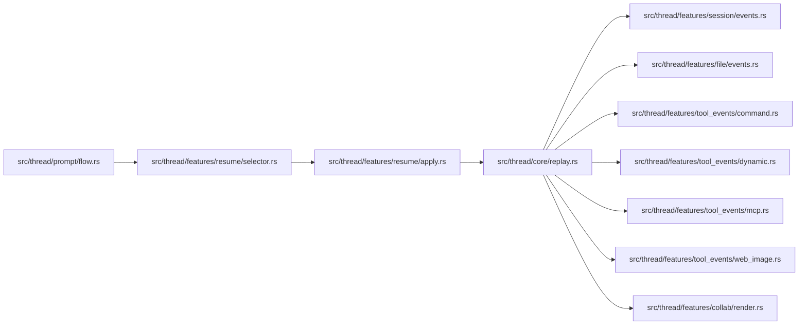
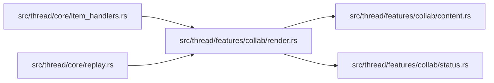

# Thread Feature Map

Единая карта связности `src/thread/**`.

Цель: быстро понять, какие файлы нужно менять вместе, чтобы локальная правка в одной ветке не ломала соседние части пайплайна.

Обновлено: `2026-03-29`.

Важно: `collab/subagents` не отдельная архитектура.
Это обычная ветка `ThreadItem::CollabAgentToolCall` внутри общего event-pipeline.

## 1) Принципы текущей структуры

1. `src/thread.rs` хранит оркестрацию, состояния и общие константы.
2. `src/thread/core/*` — роутеры и glue (`item_handlers`, `replay`, `server_requests`, `inner_state`, `terminal_updates`).
3. `src/thread/features/*` — доменные срезы (`plan`, `file`, `tool_events`, `tool_call_ui`, `collab`, `dynamic_tool_call`, `session`, `resume`, `notification`, `approvals`).
4. `src/thread/{prompt,notification,session,turn}/*` — вертикальные runtime-потоки.
5. Текущий стиль зависимости: прямые импорты из конкретных подмодулей вместо зонтичных прокладок.

## 2) Главный runtime pipeline (live turn)

```mermaid
flowchart TD
    UserClient[User/Zed] --> PromptFlow[src/thread/prompt/flow.rs]

    PromptFlow --> PromptCommands[src/thread/prompt/commands.rs]
    PromptFlow --> ResumeListing[src/thread/features/resume/listing.rs]
    PromptFlow --> ResumeSelector[src/thread/features/resume/selector.rs]
    PromptFlow --> SessionControls[src/thread/features/session/controls.rs]
    PromptFlow --> SessionModes[src/thread/features/session/modes.rs]
    PromptFlow --> TurnExecution[src/thread/turn/execution.rs]

    TurnExecution --> AppServer[src/app_server.rs]
    AppServer --> NotificationDispatch[src/thread/notification/dispatch.rs]

    NotificationDispatch -->|JSONRPCNotification| NotificationFeature[src/thread/features/notification/mod.rs]
    NotificationDispatch -->|JSONRPCRequest| ServerRequests[src/thread/core/server_requests.rs]

    ServerRequests --> ApprovalsCommand[src/thread/features/approvals/command.rs]
    ServerRequests --> ApprovalsFile[src/thread/features/approvals/file_change.rs]
    ServerRequests --> ApprovalsUserInput[src/thread/features/approvals/user_input.rs]
    ServerRequests --> ApprovalsPermissions[src/thread/features/approvals/permissions.rs]
    ServerRequests --> DynamicToolCallFlow[src/thread/features/dynamic_tool_call.rs]

    NotificationFeature --> NotificationDeltas[src/thread/features/notification/events/deltas.rs]
    NotificationFeature --> NotificationTurn[src/thread/features/notification/events/turn.rs]
    NotificationFeature --> NotificationUsage[src/thread/features/notification/events/usage.rs]
    NotificationFeature --> ItemHandlers[src/thread/core/item_handlers.rs]
    NotificationFeature --> TerminalUpdates[src/thread/core/terminal_updates.rs]
    NotificationFeature --> TurnDiff[src/thread/turn/diff.rs]

    ItemHandlers --> FileEvents[src/thread/features/file/events.rs]
    ItemHandlers --> ToolEventsCommand[src/thread/features/tool_events/command.rs]
    ItemHandlers --> ToolEventsDynamic[src/thread/features/tool_events/dynamic.rs]
    ItemHandlers --> ToolEventsMcp[src/thread/features/tool_events/mcp.rs]
    ItemHandlers --> ToolEventsWebImage[src/thread/features/tool_events/web_image.rs]
    ItemHandlers --> PlanEvents[src/thread/features/plan/events.rs]
    ItemHandlers --> CollabRender[src/thread/features/collab/render.rs]
    ItemHandlers --> SessionEvents[src/thread/features/session/events.rs]

    ToolEventsCommand --> ToolUiKind[src/thread/features/tool_call_ui/kind.rs]
    ToolEventsCommand --> ToolUiTitle[src/thread/features/tool_call_ui/title.rs]
    ToolEventsCommand --> ToolUiRaw[src/thread/features/tool_call_ui/raw.rs]
    ToolEventsCommand --> StatusMapping[src/thread/features/status_mapping.rs]
    ToolEventsMcp --> StatusMapping
    FileEvents --> StatusMapping
    FileEvents --> FileChanges[src/thread/features/file/changes.rs]

    TurnExecution --> PlanParse[src/thread/features/plan/parse.rs]
    TurnExecution --> PlanFallback[src/thread/features/plan/fallback.rs]
    TurnExecution --> ReconnectGuard[src/thread/turn/execution.rs]
```



## 3) Почему `notification` есть и в `features`, и отдельно

Это разделение по слоям:
- `src/thread/notification/dispatch.rs` — транспортный слой JSON-RPC (`notification/request/response/error`).
- `src/thread/features/notification/*` — доменная обработка событий.

`dispatch` должен маршрутизировать, а не содержать бизнес-логику.

## 4) Replay/Resume pipeline



Смысл: после `/resume` UI по умолчанию восстанавливается теми же доменными ветками, что и в live-потоке.
Для "тихого" переключения контекста без replay используется `/resume --no-history`.
Для устойчивого повторного `/resume` в одной ACP-сессии transport-хвост app-server теперь санируется в `src/thread/features/resume/apply.rs`, а сам picker создается с уникальным `ToolCallId` в `src/thread/features/resume/selector.rs`.
Смысл этой санитизации: stale notifications старого треда глушатся, stale server requests явно отклоняются ответом, а не теряются молча.
Picker и `/threads` при этом предпочитают `thread.name`, если тред был явно переименован через `/rename`, и только потом показывают `preview`.
После успешного `/resume` текущая ACP-сессия теперь сразу получает `SessionInfoUpdate.title`, чтобы клиентский заголовок не застревал на последнем slash-prompt.
Важно: старые сообщения, уже показанные ACP-клиентом, при этом не очищаются — это ограничение UI/API клиента, а не replay-пайплайна адаптера.

## 5) Collab/Subagents ветка



Ключевая инварианта: симметрия `started -> completed -> replay`.

Текущий протокольный контракт в коде:
- `CollabAgentTool`: `SpawnAgent`, `SendInput`, `ResumeAgent`, `Wait`, `CloseAgent`.
- `CollabAgentToolCallStatus`: `InProgress`, `Completed`, `Failed`.
- `CollabAgentStatus`: `PendingInit`, `Running`, `Completed`, `Errored`, `Shutdown`, `NotFound`.

Если upstream расширяет этот контракт, менять вместе:
- `src/thread/features/collab/render.rs` для title/kind/live/replay поведения;
- `src/thread/features/collab/status.rs` для ACP-status mapping и summary line;
- `src/thread/features/collab/content.rs` для text payload, `raw_input`/`raw_output` и новых полей `agents_states[*]`;
- `src/thread/core/tests.rs` для фиксированных title/status/content ожиданий;
- `README.md` и `AGENTS.md`, чтобы правила и user-facing docs не отставали от кода.

Отдельная инварианта по данным: не терять `sender_thread_id`, `receiver_thread_ids`, `prompt`, `agents_states[*].status`, `agents_states[*].message` при live/update/replay.
Текущий UI-договор поверх этого контракта: thread metadata используется как label-cache для `agent_nickname/agent_role`, prompt у `spawn/send_input` уходит в `Raw Input`, а `Raw Output` хранит краткую summary статусов вместо сырого JSON.

## 6) Что менять вместе (чеклист)

1. Новый `ThreadItem` в потоке:
- `src/thread/core/item_handlers.rs` (live started/completed)
- `src/thread/core/replay.rs` (replay)
- `src/thread/features/status_mapping.rs` (если новый status mapping)

2. Изменение plan-логики:
- `src/thread/turn/execution.rs`
- `src/thread/features/plan/fallback.rs`
- `src/thread/features/plan/parse.rs`
- `src/thread/features/plan/events.rs`
- `src/thread/features/notification/events/turn.rs`
- `src/thread/prompt/flow.rs`

3. Изменение file-change lifecycle:
- `src/thread/features/file/events.rs`
- `src/thread/features/file/changes.rs`
- `src/thread/turn/diff.rs`

4. Изменение approval-flow:
- `src/thread/core/server_requests.rs`
- `src/thread/features/approvals/command.rs`
- `src/thread/features/approvals/file_change.rs`
- `src/thread/features/approvals/user_input.rs`
- `src/thread/features/approvals/permissions.rs`
- `src/thread/features/dynamic_tool_call.rs`

5. Изменение session/config, archive и thread title:
- `src/thread/session/config/mod.rs`
- `src/thread/session/config/modes.rs`
- `src/thread/session/config/reasoning.rs`
- `src/thread/features/session/modes.rs`
- `src/thread/features/session/controls.rs`
- `src/thread/features/session/events.rs`
- `src/thread/features/notification/mod.rs`
- `src/thread/session/lifecycle.rs`
- `src/thread/turn/notify.rs` (`notify_config_update`, `notify_mode_and_config_update`)
- Если ACP-сессия стартует с `mcp_servers`, эти session-scoped overrides теперь тоже входят в этот связный набор:
  они собираются в `src/thread/session/lifecycle.rs`, хранятся в `ThreadInner`, подаются в `thread/start` / `thread/resume`
  и должны переживать replacement-thread внутри той же ACP-сессии.

6. Изменение collab/subagents контракта:
- `src/thread/features/collab/render.rs`
- `src/thread/features/collab/status.rs`
- `src/thread/features/collab/content.rs`
- `src/thread/core/item_handlers.rs`
- `src/thread/core/replay.rs`
- `src/thread/core/tests.rs`
- `README.md`
- `AGENTS.md`

## 7) Зоны повышенной связности и риски

### План и режимы
- `src/thread/prompt/flow.rs`
- `src/thread/turn/execution.rs`
- `src/thread/turn/notify.rs`
- `src/thread/features/plan/*`
- `src/thread/features/notification/events/turn.rs`

Риск: сломать переходы `Plan -> Default` и fallback при неполных plan-update.

### Маршрутизация сообщений
- `src/thread/notification/dispatch.rs`
- `src/thread/features/notification/mod.rs`
- `src/thread/core/item_handlers.rs`
- `src/thread/core/server_requests.rs`

Риск: пропущенная ветка маршрутизации или двойная обработка одного события.

### Reconnect / stalled turn guard
- `src/thread/turn/execution.rs`
- `src/thread/core/inner_state.rs`
- `src/thread/core/terminal_updates.rs`
- `src/thread/features/notification/events/deltas.rs`
- `src/thread/features/notification/events/turn.rs`

Риск: если не синхронизировать эти файлы вместе, можно либо снова получить вечную загрузку ACP UI, либо преждевременно завершать живой turn.

### Replay/Resume
- `src/thread/features/resume/*`
- `src/thread/core/replay.rs`
- `src/thread/core/inner_state.rs`
- `src/app_server.rs`
- `src/thread/prompt/flow.rs`
- `src/codex_agent.rs`

Риск: после `/resume` не сброшено turn-transient состояние.
Отдельный риск: transport-хвост старого треда может мешать следующему `/resume`, если не синхронизировать `apply.rs`, `app_server.rs` и pre-command routing в `prompt/flow.rs`. Опасный вариант здесь — blind drop request-ов; текущая версия этого уже не делает.

### Collab/Subagents
- `src/thread/features/collab/*`
- `src/thread/core/item_handlers.rs`
- `src/thread/core/replay.rs`

Риск: рассинхрон карточек live/replay, несовпадение started/completed фаз или потеря новых protocol-полей (`agents_states[*].message`, новые enum-варианты).

## 8) Feature-срезы

| Модуль | Роль |
|---|---|
| `src/thread/features/approvals/*` | Approval-flow для command/file-change/request_user_input/permissions request |
| `src/thread/features/collab/*` | Рендер, контент и статусы collab/subagent tool-call карточек |
| `src/thread/features/file/*` | File-change lifecycle, preview/final diff helper-ы |
| `src/thread/features/notification/*` | Доменные обработчики notification-событий |
| `src/thread/features/plan/*` | Plan parsing, fallback state-machine, plan item события |
| `src/thread/features/resume/*` | `/threads`, `/resume` (`--no-history`), выбор и применение thread, transport scrub при переключении |
| `src/thread/features/session/*` | `/compact`, `/undo`, `/context`, `/plan on/off`, `/rename`, `/archive`, `/unarchive`, archive/unarchive picker UI, session replay события и title update |
| `src/thread/features/tool_events/*` | Lifecycle command/mcp/web/image карточек |
| `src/thread/features/tool_call_ui/*` | Эвристики вида карточки + title/raw payload |
| `src/thread/features/status_mapping.rs` | app-server status -> ACP status |

## 9) Практические правила безопасного редактирования

1. Держать `notification/dispatch` и `core/server_requests` тонкими роутерами.
2. Любой новый lifecycle добавлять симметрично: `started`, `completed`, `replay`.
3. Для turn-зависимых событий сохранять guard по `expected_turn_id`.
4. После изменений mode/config отправлять обновления через `src/thread/turn/notify.rs` (`notify_config_update`/`notify_mode_and_config_update`).
5. Не возвращать доменную логику в корневой `thread.rs` без явной архитектурной причины.

## 10) Экспорт для визуализации

Сгенерировать машинные форматы из этой карты:

```bash
script/export_thread_feature_map.py
```

Артефакты генерируются локально и сейчас не хранятся в репозитории как tracked-файлы:
- `docs/thread-feature-map.graph.json` — граф (`nodes`/`edges`) для сайтов/скриптов.
- `docs/thread-feature-map.graph.mmd` — Mermaid graph (вставлять в `https://mermaid.live`).
- `docs/thread-feature-map.markmap.md` — mind map markdown (вставлять в `https://markmap.js.org/repl`).
