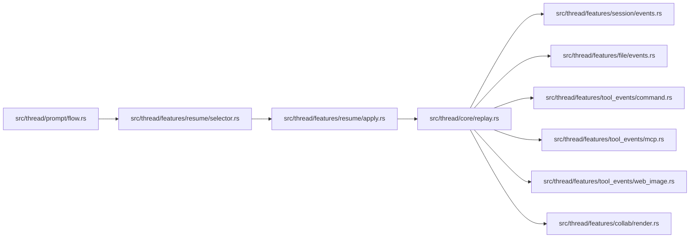
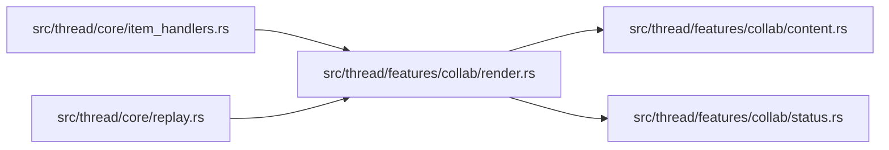

# Thread Feature Map

Unified dependency and change map for `src/thread/**`.

Goal: make it obvious which files must move together so a local fix in one branch does not quietly break a neighboring part of the pipeline.

Updated: `2026-03-08`.

Important: `collab/subagents` is not a separate architecture. It is a regular `ThreadItem::CollabAgentToolCall` branch inside the shared event pipeline.

## 1) Structural principles

1. `src/thread.rs` owns orchestration, shared state, and cross-cutting constants.
2. `src/thread/core/*` contains routers and glue (`item_handlers`, `replay`, `server_requests`, `inner_state`, `terminal_updates`).
3. `src/thread/features/*` contains domain slices (`plan`, `file`, `tool_events`, `tool_call_ui`, `collab`, `session`, `resume`, `notification`, `approvals`).
4. `src/thread/{prompt,notification,session,turn}/*` contains vertical runtime flows.
5. Dependencies are intentionally direct between concrete submodules rather than routed through large umbrella facades.

## 2) Main runtime pipeline (live turn)

```mermaid
flowchart TD
    UserClient[User/Zed] --> PromptFlow[src/thread/prompt/flow.rs]

    PromptFlow --> PromptCommands[src/thread/prompt/commands.rs]
    PromptFlow --> ResumeListing[src/thread/features/resume/listing.rs]
    PromptFlow --> ResumeSelector[src/thread/features/resume/selector.rs]
    PromptFlow --> SessionControls[src/thread/features/session/controls.rs]
    PromptFlow --> SessionModes[src/thread/features/session/modes.rs]
    PromptFlow --> TurnExecution[src/thread/turn/execution.rs]

    TurnExecution --> AppServer[src/app_server.rs]
    AppServer --> NotificationDispatch[src/thread/notification/dispatch.rs]

    NotificationDispatch -->|JSONRPCNotification| NotificationFeature[src/thread/features/notification/mod.rs]
    NotificationDispatch -->|JSONRPCRequest| ServerRequests[src/thread/core/server_requests.rs]

    ServerRequests --> ApprovalsCommand[src/thread/features/approvals/command.rs]
    ServerRequests --> ApprovalsFile[src/thread/features/approvals/file_change.rs]
    ServerRequests --> ApprovalsUserInput[src/thread/features/approvals/user_input.rs]

    NotificationFeature --> NotificationDeltas[src/thread/features/notification/events/deltas.rs]
    NotificationFeature --> NotificationTurn[src/thread/features/notification/events/turn.rs]
    NotificationFeature --> NotificationUsage[src/thread/features/notification/events/usage.rs]
    NotificationFeature --> ItemHandlers[src/thread/core/item_handlers.rs]
    NotificationFeature --> TerminalUpdates[src/thread/core/terminal_updates.rs]
    NotificationFeature --> TurnDiff[src/thread/turn/diff.rs]

    ItemHandlers --> FileEvents[src/thread/features/file/events.rs]
    ItemHandlers --> ToolEventsCommand[src/thread/features/tool_events/command.rs]
    ItemHandlers --> ToolEventsMcp[src/thread/features/tool_events/mcp.rs]
    ItemHandlers --> ToolEventsWebImage[src/thread/features/tool_events/web_image.rs]
    ItemHandlers --> PlanEvents[src/thread/features/plan/events.rs]
    ItemHandlers --> CollabRender[src/thread/features/collab/render.rs]
    ItemHandlers --> SessionEvents[src/thread/features/session/events.rs]

    ToolEventsCommand --> ToolUiKind[src/thread/features/tool_call_ui/kind.rs]
    ToolEventsCommand --> ToolUiTitle[src/thread/features/tool_call_ui/title.rs]
    ToolEventsCommand --> ToolUiRaw[src/thread/features/tool_call_ui/raw.rs]
    ToolEventsCommand --> StatusMapping[src/thread/features/status_mapping.rs]
    ToolEventsMcp --> StatusMapping
    FileEvents --> StatusMapping
    FileEvents --> FileChanges[src/thread/features/file/changes.rs]

    TurnExecution --> PlanParse[src/thread/features/plan/parse.rs]
    TurnExecution --> PlanFallback[src/thread/features/plan/fallback.rs]
```



## 3) Why `notification` exists both in `features` and outside it

This split is intentional:

- `src/thread/notification/dispatch.rs` is the JSON-RPC transport router (`notification/request/response/error`).
- `src/thread/features/notification/*` is the domain-level event handling layer.

`dispatch` should route, not contain business logic.

## 4) Replay / resume pipeline



Meaning: after `/resume`, the UI is rebuilt through the same domain handlers used during live execution.

Notes:

- `/resume` replays history by default.
- `/resume --no-history` switches context without replaying prior messages into the current ACP chat.
- `load_session` replays stored history, while ACP `resume_session` does not.

## 5) Collab / sub-agent branch



Key invariant: preserve `started -> completed -> replay` symmetry.

## 6) Files that usually change together

1. New `ThreadItem` branch:
- `src/thread/core/item_handlers.rs`
- `src/thread/core/replay.rs`
- `src/thread/features/status_mapping.rs` if status mapping changes

2. Plan behavior changes:
- `src/thread/turn/execution.rs`
- `src/thread/features/plan/fallback.rs`
- `src/thread/features/plan/parse.rs`
- `src/thread/features/plan/events.rs`
- `src/thread/features/notification/events/turn.rs`
- `src/thread/prompt/flow.rs`

3. File-change lifecycle changes:
- `src/thread/features/file/events.rs`
- `src/thread/features/file/changes.rs`
- `src/thread/turn/diff.rs`

4. Approval-flow changes:
- `src/thread/core/server_requests.rs`
- `src/thread/features/approvals/command.rs`
- `src/thread/features/approvals/file_change.rs`
- `src/thread/features/approvals/user_input.rs`

5. Session/config changes:
- `src/thread/session/config/mod.rs`
- `src/thread/session/config/modes.rs`
- `src/thread/session/config/reasoning.rs`
- `src/thread/features/session/modes.rs`
- `src/thread/features/session/events.rs`
- `src/thread/turn/notify.rs` (`notify_config_update`, `notify_mode_and_config_update`)

## 7) High-coupling zones and common risks

### Plan and mode handling

- `src/thread/prompt/flow.rs`
- `src/thread/turn/execution.rs`
- `src/thread/turn/notify.rs`
- `src/thread/features/plan/*`
- `src/thread/features/notification/events/turn.rs`

Risk: breaking `Plan -> Default` transitions or fallback behavior on incomplete plan updates.

### Message routing

- `src/thread/notification/dispatch.rs`
- `src/thread/features/notification/mod.rs`
- `src/thread/core/item_handlers.rs`
- `src/thread/core/server_requests.rs`

Risk: missing a route or handling the same event twice.

### Replay / resume

- `src/thread/features/resume/*`
- `src/thread/core/replay.rs`
- `src/thread/core/inner_state.rs`

Risk: not resetting turn-transient state before replay or resume transitions.

### Collab / subagents

- `src/thread/features/collab/*`
- `src/thread/core/item_handlers.rs`
- `src/thread/core/replay.rs`

Risk: live/replay card drift or broken started/completed symmetry.

## 8) Feature slices

| Module | Role |
|---|---|
| `src/thread/features/approvals/*` | Approval flow for command, file change, and request-user-input paths |
| `src/thread/features/collab/*` | Rendering and status summaries for collab/sub-agent tool-call cards |
| `src/thread/features/file/*` | File-change lifecycle and diff helpers |
| `src/thread/features/notification/*` | Domain handlers for notification events |
| `src/thread/features/plan/*` | Plan parsing, fallback state machine, and plan item handling |
| `src/thread/features/resume/*` | `/threads`, `/resume`, thread selection, and thread application |
| `src/thread/features/session/*` | `/compact`, `/undo`, `/context`, `/reasoning`, `/plan on/off`, session replay events |
| `src/thread/features/tool_events/*` | Lifecycle handling for command, MCP, web, and image cards |
| `src/thread/features/tool_call_ui/*` | Tool-call kind, title, and raw-payload heuristics |
| `src/thread/features/status_mapping.rs` | app-server status to ACP status mapping |

## 9) Safe-editing rules

1. Keep `notification/dispatch` and `core/server_requests` as thin routers.
2. Add any new lifecycle symmetrically: `started`, `completed`, `replay`.
3. Preserve `expected_turn_id` guards for turn-bound events.
4. After changing mode or config state, send updates through `src/thread/turn/notify.rs` (`notify_config_update`, `notify_mode_and_config_update`).
5. Do not move domain logic back into root `thread.rs` without a clear architectural reason.

## 10) Export formats for visualization

Generate machine-readable exports from this map:

```bash
script/export_thread_feature_map.py
```

Artifacts:

- `docs/thread-feature-map.graph.json`: graph data (`nodes` / `edges`) for scripts or websites
- `docs/thread-feature-map.graph.mmd`: Mermaid graph for `https://mermaid.live`
- `docs/thread-feature-map.markmap.md`: mind map markdown for `https://markmap.js.org/repl`
